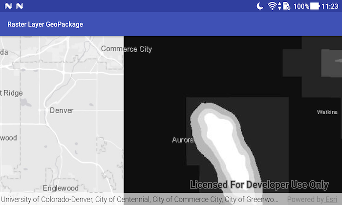

# Raster Layer GeoPackage

This sample demonstrates how to open a GeoPackage, obtain a raster from the package, and display the table as a RasterLayer.

## Features

* GeoPackage
* GeoPackageRaster
* RasterLayer

## Developer Pattern

1. Create a `GeoPackage` by passing the path to a `.gpkg` file stored locally on the device. 
1. Once READ permissions have been granted, load the `GeoPackage` with `.loadAsync()`.
1. Add a `.doneLoadingListener()` to the `GeoPackage` and check that the `GeoPackage.getLoadStatus() == LoadStatus.LOADED`.
1. Create a `RasterLayer` by obtaining the first `Raster` in the list of `.getGeoPackageRasters()`, and passing that `Raster` to the `RasterLayer`. 
1. Finally, add the `RasterLayer` the Map's operational layers.

## Provision your device
1. Download the data from [ArcGIS Online](https://www.arcgis.com/home/item.html?id=68ec42517cdd439e81b036210483e8e7).
1. Extract the contents of the downloaded zip file to disk.
1. Open your command prompt and navigate to the folder where you extracted the contents of the data from step 1.
1. Execute the following command: `adb push AuroraCO.gpkg /sdcard/ArcGIS/Samples/GeoPackage/AuroraCO.gpkg`

Link | Local Location
---------|-------|
|[Aurora CO GeoPackage](https://www.arcgis.com/home/item.html?id=68ec42517cdd439e81b036210483e8e7)| `<sdcard>`/ArcGIS/Samples/GeoPackage/AuroraCO.gpkg|