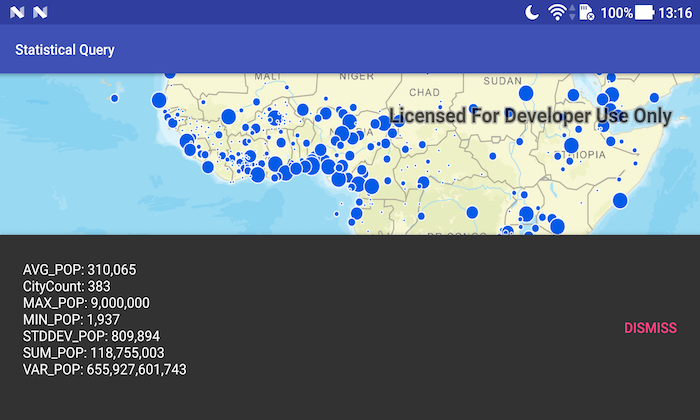

# Statistical Query

This sample demonstrates how to query a table to get aggregated statistics back for a specific field.

## Features

* QueryParameters;
* ServiceFeatureTable;
* StatisticDefinition;
* StatisticRecord;
* StatisticType;
* StatisticsQueryParameters;
* StatisticsQueryResult;

## Developer Pattern

1. Create a `ServiceFeatureTable` with a URL to the REST endpoint of a feature service. 
1. Create `StatisticsQueryParameters`, and `StatisticDefinition` objects, and add to the parameters. These definitions define the various statistics that we would like to compute from a given field, including:
    * average
    * count
    * minimum
    * maximum 
    * sum
    * standard deviation
    * variance
1. Execute `queryStatistics` on the `ServiceFeatureTable`. Depending on the state of the two checkboxes, additional parameters are set. This process runs asynchronously, and once complete, this gives access to the `QueryStatisticsResult`, which contains key/value pairs.